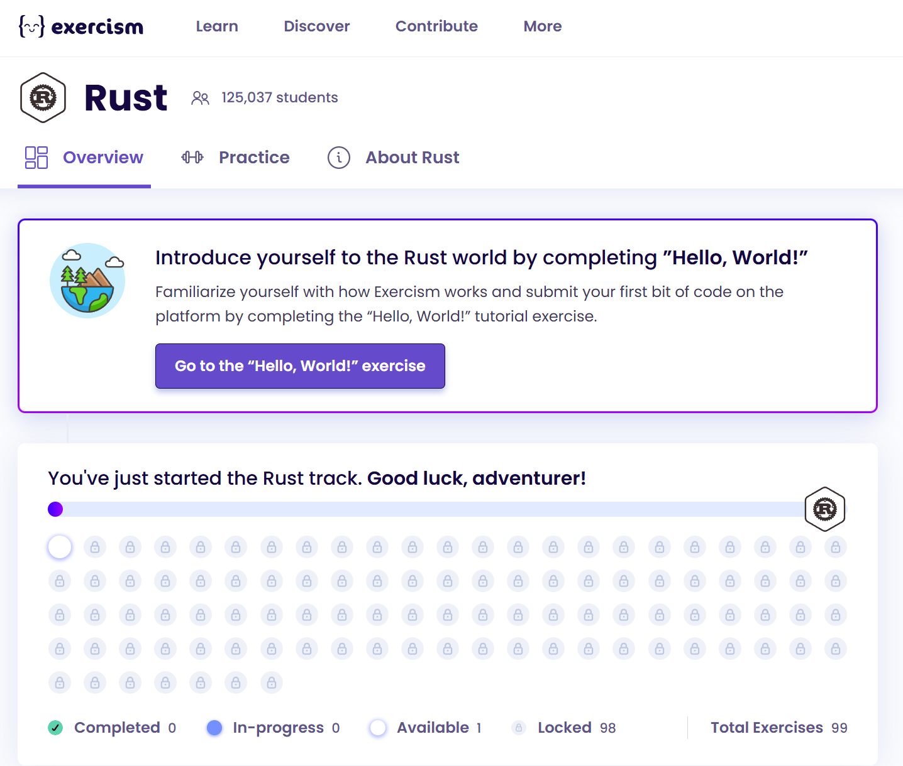

### 1

Переходимо за [посиланням](https://exercism.org/tracks/rust) та авторизуємося. Це треба зробити для того щоб ви не втрачали свій прогрес, тому що потім треба буде продемонструвати результат.

### 2

Для того щоб почати треба натиснути кнопку `Join the Rust Track`:


### 3

Далі треба пройти перше завдання ”Hello, World!”



### 4

Натискаємо `Start in editor`


### 4 

Треба замінити вивід "Goodbye, Mars!" на "Hello, World!"
```rust
pub fn hello() -> &'static str {
    "Hello, World!"
}
```

### 4

Коли ви хочете перевірити своє рішеня, натискаємо на `Run Tests`


### 4
Якщо ви все зробили правильно то побачите `All tests passed`


Натискаємо `Submit`

### 4 

Нас повернуть до стартової сторінки завдання і треба натиснути `Mark as complete` та прив`язати свою навчальну github репозиторію


Натискаємо `Configure backups` це перенаправить вас на сторінку [GitHub Syncer](https://exercism.org/settings/github_syncer)


### 4 

Натискаємо `Setup Backup`


### 4
Вибираємо організацію `rust-bootcamp` і `Only select repositories` де вказуємо ту репозиторію яку вам видали для проходженя курсу


На цьому все, прив`язка виконана і ви маєте побачити 
`Status: Active`

### 5

- Crate — це мінімальна одиниця компіляції в Rust. Кожен крейт являє собою окремий проєкт чи бібліотеку. Крейт може бути виконуваним (binary crate) або бібліотечним (library crate). Кожен крейт компілюється незалежно, що дозволяє збирати й використовувати код повторно в різних проєктах.

- package - це те, що публікується. Він може містити один або декілька крейтів. Пакет визначає структуру проєкту і включає крейти, документацію, метадані та інші необхідні файли для того, щоб бути опублікованим і розповсюдженим.

- Cargo - це менеджер пакетів для Rust, який компілює крейти, управляє залежностями та публікаціями. Cargo автоматизує процеси, пов'язані з побудовою проєктів (крейти), завантаженням залежностей та публікацією на crates.io.

- paths - це структура, яка дозволяє доступ до елементів крейту або модуля. Шляхи використовуються для імпорту модулів, функцій, структур та інших компонентів в Rust. Вони можуть бути абсолютними або відносними.

- module - це структурна одиниця коду, що дозволяє організовувати код у зручні для керування блоки. Модулі допомагають структурувати код, приховувати внутрішню реалізацію та розділяти різні частини проєкту для кращого управління і читабельності.

### 6

взаємозв'язок Crate - package:
Крейт — це одиниця, що компілюється, тоді як пакет — це те, що публікується і може містити кілька крейтів.

### 7

взаємозв'язок Cargo - crate:
Cargo компілює крейти, керує залежностями та забезпечує публікацію на crates.io.

### 8

взаємозв'язок Crate - module
Модуль це структурна одиниця коду. А крейт це структурна одиниця компіляції. Кожен крейт є модулем але не кожен модуль є крейтом.

### 9

взаємозв'язок Cargo - package:
Cargo допомагає розповсюджувати пакети, що складаються з одного чи кількох крейтів, через crates.io.


### 11

`Rust playground` це важливий інструмент екосистеми Rust який використовують розробники для того щоб ділитись кодом з іншими розробниками та була можливість зробити маленький експеримент або перевірити свою гіпотизу. Знаходиться цей інструмент за адресою `https://play.rust-lang.org/`.


### 13

Далі навчимось користуватись `Rust playground` та ділитись своїм кодом.

### 14

Напишемо просту программу у `Rust playground` та навчимось ділитись кодом з іншими.
Приклад програми:


### 15

Щоб поділитись кодом з іншими, треба натиснути на кнопку `Share`:


### 16

Далі порібно згенерувати унікальне постійне посилання:


Тепер можна скопіювати посилання і ділитись своїм кодом.


