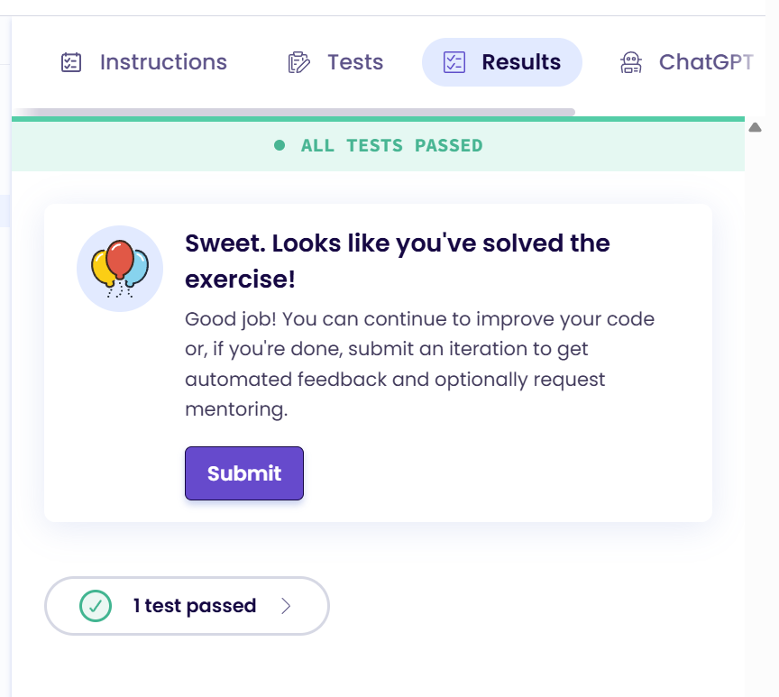

### 1

Переходимо за [посиланням](https://exercism.org/tracks/rust) та авторизуємося. Це треба зробити для того щоб ви не втрачали свій прогрес, тому що потім треба буде продемонструвати результат.

### 2

Для того щоб почати треба натиснути кнопку `Join the Rust Track`:


### 3

Далі треба пройти перше завдання ”Hello, World!”


### 4

Натискаємо `Start in editor`


### 4 

Треба замінити вивід "Goodbye, Mars!" на "Hello, World!"
```rust
pub fn hello() -> &'static str {
    "Hello, World!"
}
```

### 4

Коли ви хочете перевірити своє рішеня, натискаємо на `Run Tests`


### 4
Якщо ви все зробили правильно то побачите `All tests passed`




Натискаємо `Submit`

### 4 

Нас повернуть до стартової сторінки завдання і треба натиснути `Mark as complete` та прив`язати свою навчальну github репозиторію


Натискаємо `Configure backups` це перенаправить вас на сторінку [GitHub Syncer](https://exercism.org/settings/github_syncer)


### 4 

Натискаємо `Setup Backup`


### 4
Вибираємо організацію `rust-lang-ua` і `Only select repositories` де вказуємо ту репозиторію яку вам видали для проходженя курсу


На цьому все, прив`язка виконана і ви маєте побачити 


`Status: Active`

