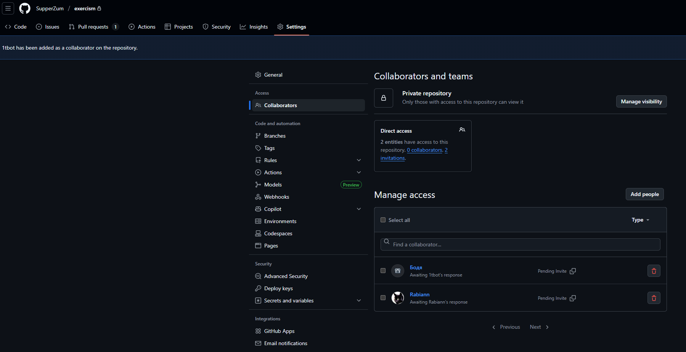

### 1

Переходимо за [посиланням](https://exercism.org/tracks/rust) та авторизуємося. Це потрібно зробити для того, щоб ви не втрачали свій прогрес, адже потім треба буде продемонструвати результат.

### 2

Щоб почати, потрібно натиснути кнопку `Join the Rust Track`:


### 3

Далі проходимо перше завдання “Hello, World!”


### 4

Натискаємо `Start in editor`


### 5

Замінюємо вивід "Goodbye, Mars!" на "Hello, World!":

```rust
pub fn hello() -> &'static str {
    "Hello, World!"
}
```

### 6

Коли хочете перевірити своє рішення, натискайте на `Run Tests`:


### 7

Якщо ви все зробили правильно, то побачите `All tests passed`.


Далі натискаємо `Submit`.

### 8

Вас поверне до стартової сторінки завдання. Тут потрібно натиснути `Mark as complete` та прив’язати свою навчальну GitHub-репозиторію.


Натискаємо `Configure backups`. Це перенаправить вас на сторінку [GitHub Syncer](https://exercism.org/settings/github_syncer).

### 9

Тепер відкриваємо GitHub.

У правому верхньому куті натискаємо `+` та `New repository`.


### 10

Створюємо нову репозиторію, де ви є власником. Робимо її приватною та додаємо README - усе як на скріншоті.


### 11

Потім переходимо в налаштування репозиторію → `Collaborators` та додаємо три акаунти:

* Rabiann
* SupperZum
* 1tbot



### 12

Далі повертаємося на сторінку [GitHub Syncer](https://exercism.org/settings/github_syncer) та натискаємо `Setup Backup`.


### 13

Вибираємо свій нікнейм, після чого з’явиться можливість вибрати репозиторію. Натискаємо `Only select repositories` та вказуємо ту репозиторію, яку ви щойно створили.


На цьому все: прив’язка виконана, і ви маєте побачити повідомлення

`Status: Active`


### 14

Тепер усі завдання, які ви виконуватимете, будуть автоматично завантажуватися у вашу репозиторію через Pull Requests.
Pull Requests не чіпаємо - вони мають залишатися відкритими.

Якщо завдання, які ви виконали до налаштування синхронізації, не з’являються у Pull Requests, завжди можна повернутися на сторінку завдання й запустити синхронізацію вручну.


Для цього натискаємо `Trigger solution backup`, і Pull Request з цим завданням з’явиться у репозиторії.


